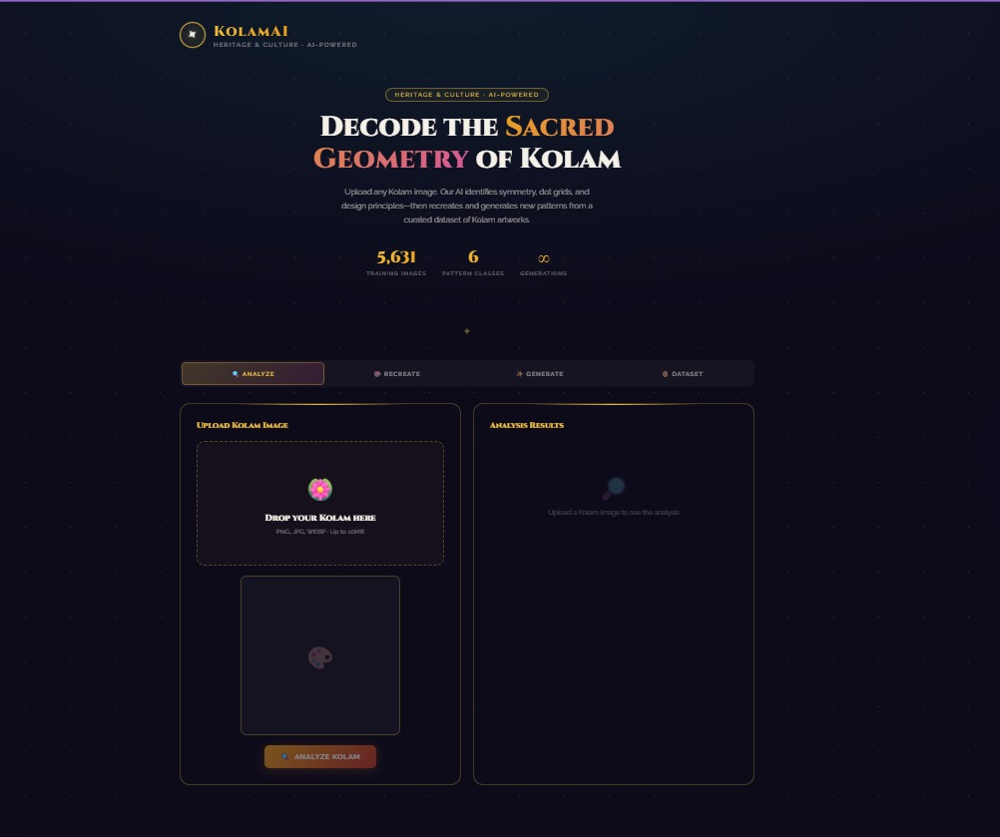
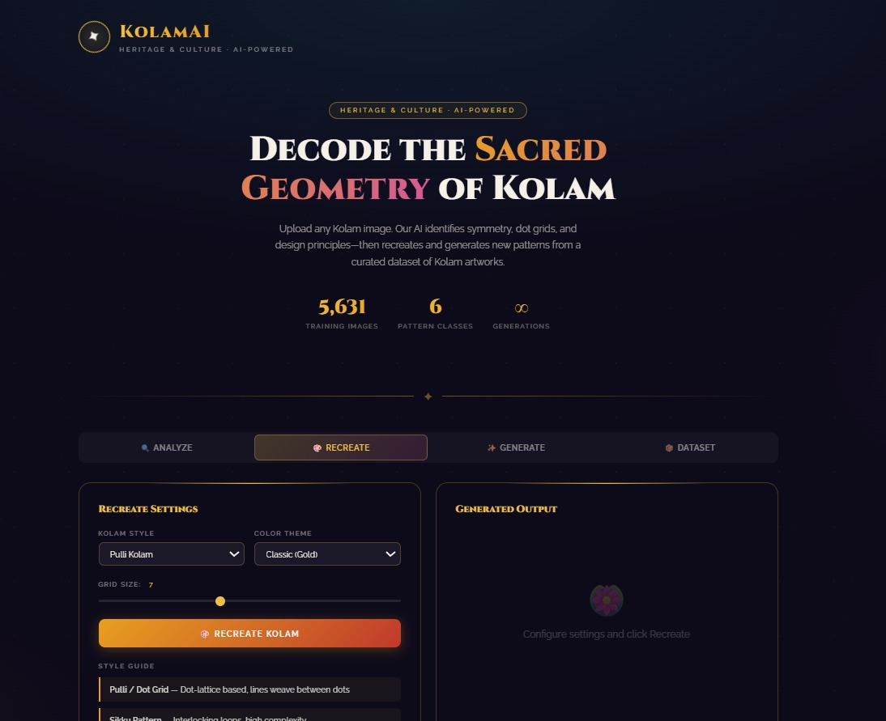
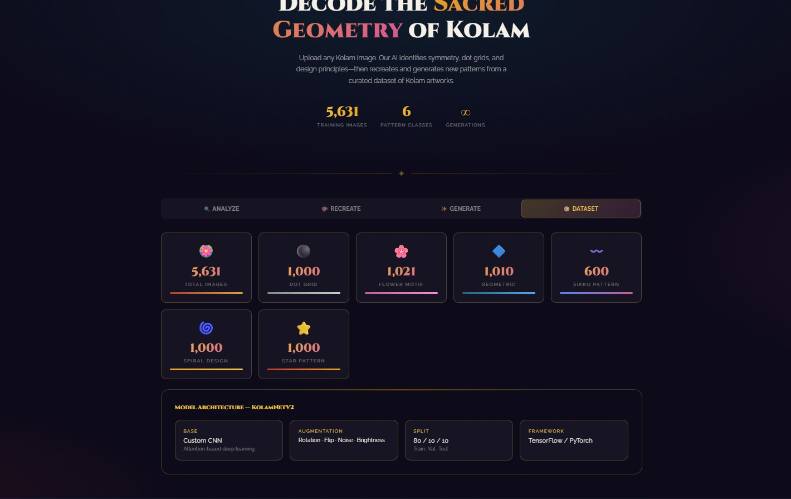
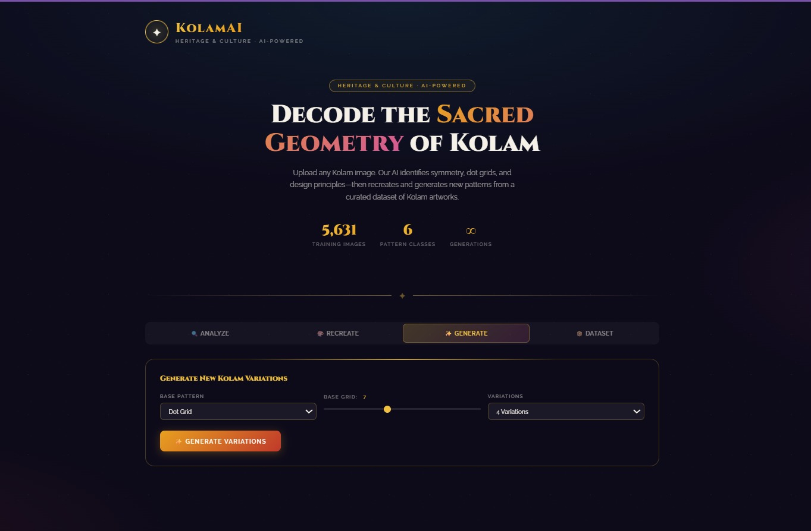

<div align="center">


# 🪷 KolamAI

### AI-Powered Kolam Pattern Analysis & Recreation

[](https://python.org)
[](https://tensorflow.org)
[](https://flask.palletsprojects.com)
[](https://keras.io/api/applications/efficientnet/)

*Decode the sacred geometry of South Indian Kolam art using deep learning*

</div>

---

## ✨ What is KolamAI?

Kolam is a sacred South Indian art form — intricate patterns drawn using rice powder at doorsteps, rich in mathematical symmetry and cultural symbolism. KolamAI is a deep learning system that:

- 🔍 **Analyzes** uploaded Kolam images — symmetry, dot grids, line patterns, complexity
- 🧠 **Classifies** the Kolam type using a fine-tuned EfficientNetB3 model
- 🎨 **Recreates** Kolams digitally based on inferred design principles
- ✨ **Generates** new Kolam variations inspired by learned patterns

---

## 📸 Screenshots

<div align="center">
 
 
</div>

---

## 🧠 Model

Built on **EfficientNetB3** pretrained on ImageNet, fine-tuned on our custom dataset of **5,631 hand-curated and annotated Kolam images** across 6 classes.

| Class | Images |
|-------|--------|
| Dot Grid | 1,000 |
| Flower Motif | 1,021 |
| Geometric | 1,010 |
| Sikku Pattern | 600 |
| Spiral Design | 1,000 |
| Star Pattern | 1,000 |

**Training strategy:**
- Phase 1 — Head training with frozen EfficientNetB3 base
- Phase 2 — Fine-tuning top 30 layers with low learning rate (2e-5)
- EfficientNet-native `preprocess_input` (key fix for correct feature extraction)
- Stratified 80/20 train-val split with class weights for imbalance handling

---

## 🏗️ Project Structure

```
KolamAI/
├── backend/
│   ├── app.py              # Flask REST API
│   ├── train.py            # Model training script
│   ├── kolam_model.keras   # Trained model (not in repo — see Releases)
│   └── requirements.txt
├── frontend/
│   └── index.html          # Single-file UI
├── dataset/                # Place dataset here (not in repo)
│   ├── Dot_Grid/
│   ├── Flower_Motif/
│   ├── Geometric/
│   ├── Sikku_Pattern/
│   ├── Spiral_Design/
│   └── Star_Pattern/
├── docker-compose.yml
├── .gitignore
└── README.md
```

---

## 🚀 Quick Start

### 1. Clone the repo
```bash
git clone https://github.com/Tanviiii17/KolamAI.git
cd KolamAI
```

### 2. Set up backend
```bash
cd backend
python -m venv venv
venv\Scripts\activate        # Windows
# source venv/bin/activate   # Mac/Linux
pip install -r requirements.txt
```

### 3. The trained model
`kolam_model.keras` is already included in the `backend/` folder — no separate download needed.

### 4. Run the backend
```bash
python app.py
# API running at http://localhost:5000
```

### 5. Run the frontend
```bash
cd ../frontend
python -m http.server 3000
# Visit http://localhost:3000
```

---

## 🔌 API Endpoints

| Method | Endpoint | Description |
|--------|----------|-------------|
| `GET` | `/api/health` | Health check + model status |
| `POST` | `/api/analyze` | Analyze Kolam image (base64) |
| `POST` | `/api/recreate` | Recreate by style + grid size |
| `POST` | `/api/generate` | Generate new variations |
| `GET` | `/api/dataset/stats` | Dataset statistics |

---

## 🛠️ Tech Stack

| Layer | Technologies |
|-------|-------------|
| **ML Model** | TensorFlow 2.17, EfficientNetB3, Keras |
| **Backend** | Python 3.11, Flask, OpenCV, NumPy, Pillow |
| **Frontend** | HTML5, CSS3, Vanilla JS |
| **Training** | Google Colab T4 GPU |
| **DevOps** | Docker, GitHub |

---

## 🌏 Impact

- **Cultural Preservation** — Digitally archives diverse Kolam traditions
- **Education** — Interactive tool to teach geometry, symmetry, and Indian heritage
- **Creative Tool** — Artists can experiment and generate new Kolams digitally
- **Research** — Foundation for computational analysis of traditional art forms

---

## 📚 References

- [KolamNetV2 — Nature Scientific Reports](https://www.nature.com/articles/s40494-024-01167-8)
- [Kolam Simulation using Lattice Points — arXiv](https://arxiv.org/abs/2307.02144)
- [Tamil Kolam Entropy Study — PMC](https://pmc.ncbi.nlm.nih.gov/articles/PMC10427318/)
- [UNESCO AI & Cultural Heritage](https://ich.unesco.org/en/news/exploring-the-impact-of-artificial-intelligence-and-intangible-cultural-heritage-13536)
- [Geometrical Beauty of Kolams](https://americankahani.com/lifestyle/kolams-the-geometrical-and-mathematical-beauty-of-traditional-indian-art/)

---

## 📦 Model Download

The trained model file (`kolam_model.keras`, ~43MB) is too large for GitHub. Download it from the [Releases](https://github.com/Tanviiii17/KolamAI/releases/tag/v1.0) page and place it in the `backend/` folder.

---

<div align="center">
Made with 🪷 for Indian Heritage & Culture
</div>
